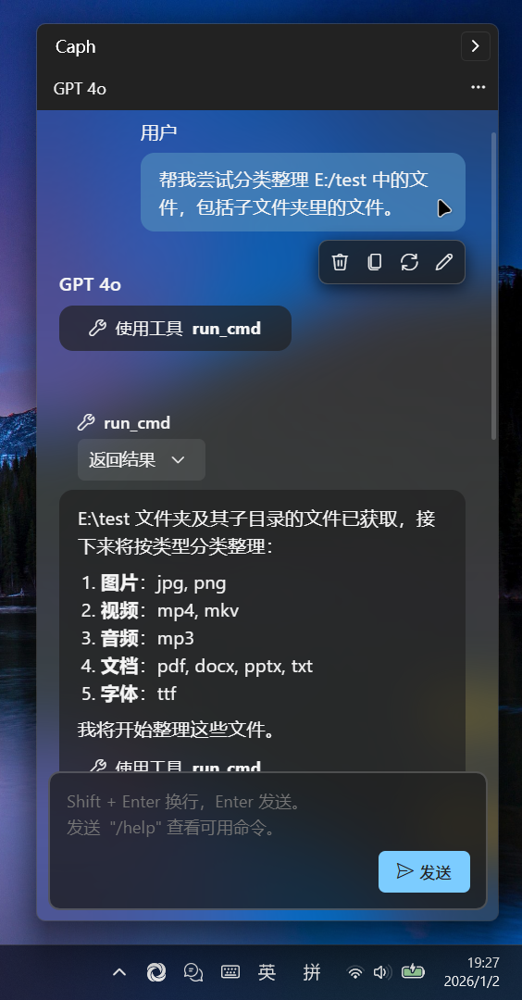

<div align="center">
    
    <h1 style="margin: 10px;">Caph</h1>
    <p>由 星源 开发 | Developed by Starry Source</p>
</div>

用于 Windows 的桌面 Copilot 助手的平替。

可使用 Github Models 的免费模型（有额度）

支持调用工具，帮助操作电脑。



（请以实际界面和功能为准）

## 使用说明
### 普通使用

在页面右侧 Release 中下载最新版，即可使用。

### 生成

1. 使用 Visual Studio 生成（WPF 应用，项目解决方案在 `/viewer/Webapp.sln`）。
2. 需要有 python（3.9 最佳），安装 django。

### 运行

1. 在 `/py` 目录下启动服务：
    ```bash
    python manage.py runserver 777
    ```
2. 打开 Visual Studio 生成的 exe 文件

### 自定义工具

在 `/py/caph/static/tools.js` 中，具体参见注释说明。