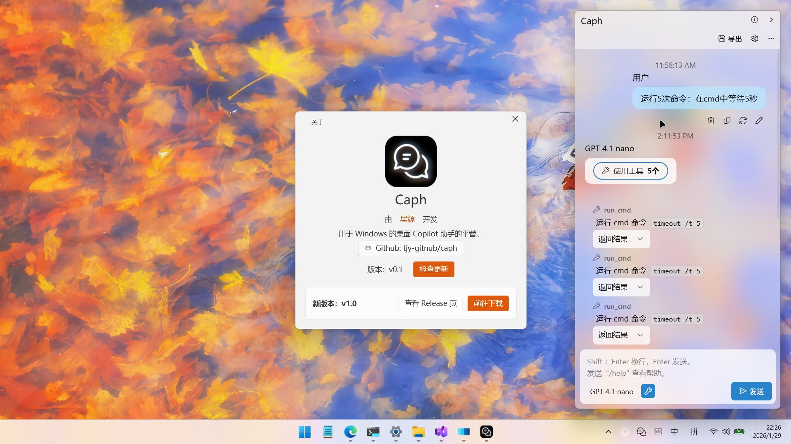
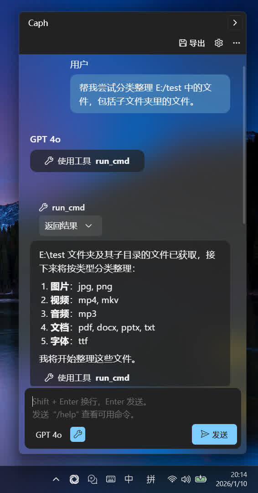
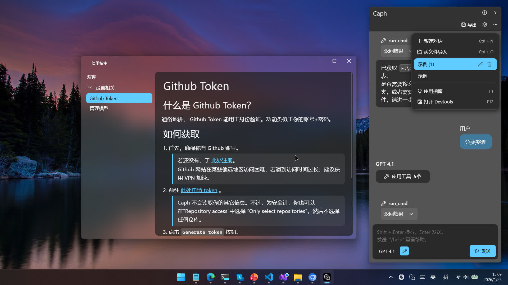

<div align="center">
    
    <h1 style="margin: 10px;">Caph</h1>
    <p>由 星源 开发 | Developed by Starry Source</p>
</div>

用于 Windows 的桌面 Copilot 助手的平替。

可使用 Github Models 的免费模型（含 deepseek, gpt4o, gpt4.1 等，有额度）

支持多种格式渲染，支持工具调用。(详见 [功能](#功能))

（请以实际界面和功能为准）






# 普通使用

在页面右侧 Release 中下载最新版压缩包，解压后即可使用。

# 功能

- AI 聊天
    - md 渲染
    - 代码渲染
    - 流程图、思维导图渲染
    - svg 图像渲染
    - 对话内容编辑
- AI 模型
    - Github API 适配
    - 多模型管理
- 多对话管理
    - 历史管理
    - 文件导入、导出
- 使用指南
    - 详细的使用指导、疑难解答
- 工具调用
    - 工具管理
    - 自定义工具（要有环境以生成，见下）

# 生成与运行

若你需要自定义工具，只需 Python 环境即可。

## 一、Python 后端

### 环境

需要有 python（3.9 最佳），安装 django, markdown2 等。（自己看报错，求饶orz）

### 运行

1. 在 `/py` 目录下启动服务：
    ```bash
    python manage.py runserver 777
    ```
2. 打开 Release 下载的包中 `/_/Webapp.exe`。当然如果你修改了外壳窗口，也可以使用你自己的程序。

### 自定义工具

在 `/py/static/tools.js` 中，具体参见注释说明。

## 二、外壳

外壳主要是 WPF 窗体，通过 CEF 嵌套了 web 界面。

### 环境

Visual Studio 2026，安装 .NET 桌面开发（项目解决方案在 `/viewer/Webapp/Webapp.sln`）。